# 여행기록
##### 여행일정관리앱, ios 🗺


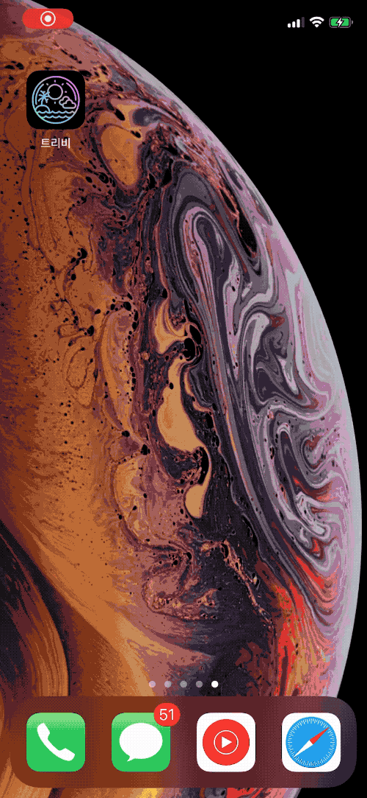

구글 지도와 Realm을 사용하여 만듬
쉽게 여행 일정과 여행 경비를 관리

<a href="https://apps.apple.com/app/%ED%8A%B8%EB%A6%AC%EB%B9%84/id1474451502">

</a>


## ⚠️⚠️Caution⚠️⚠️

You need your own AppDelegate.swift to run this program.

AppDelegate.swift	

~~~swift
```
import UIKit
import GoogleMaps
import GooglePlaces
import IQKeyboardManagerSwift
@UIApplicationMain
class AppDelegate: UIResponder, UIApplicationDelegate {
    
    var window: UIWindow?

    func application(_ application: UIApplication, didFinishLaunchingWithOptions launchOptions: [UIApplication.LaunchOptionsKey: Any]?) -> Bool {
        // Override point for customization after application launch.
      Singleton.shared.googleMapAPIKey = "⚠️Your own google API Key⚠️"
      if let api = Singleton.shared.googleMapAPIKey {
        GMSServices.provideAPIKey(api)
        GMSPlacesClient.provideAPIKey(api)
      }
        IQKeyboardManager.shared.enable = true
      self.window = UIWindow(frame: UIScreen.main.bounds)
      
      self.window?.rootViewController = TabbarViewController()
      self.window?.makeKeyAndVisible()
      
      return true

    }
}

```
~~~

You need a pod install.
Then run 'GOtravel.xcworkspace'.

Done! 🥳

# 소개

## 메인

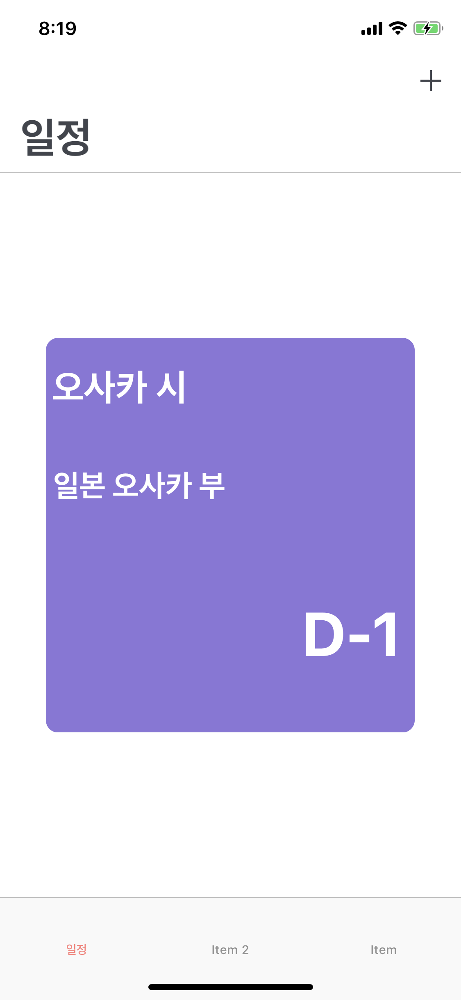


## 여행지 추가
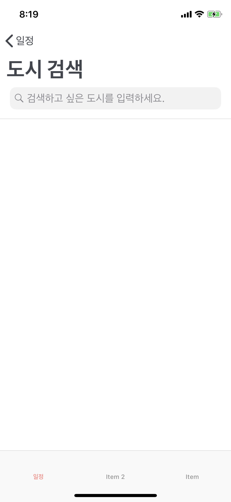
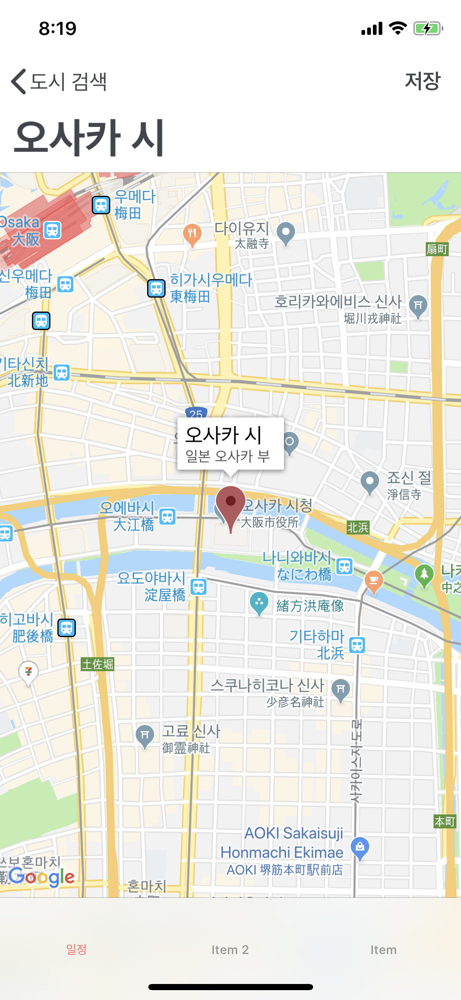
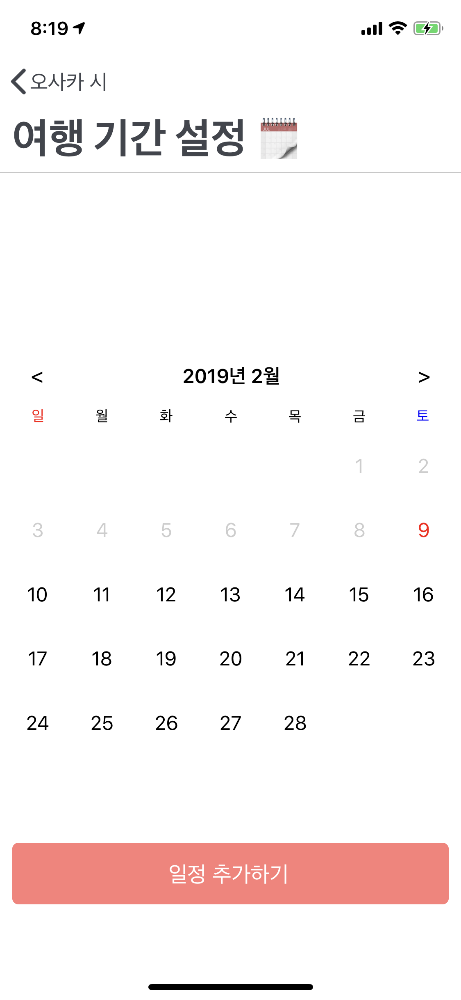
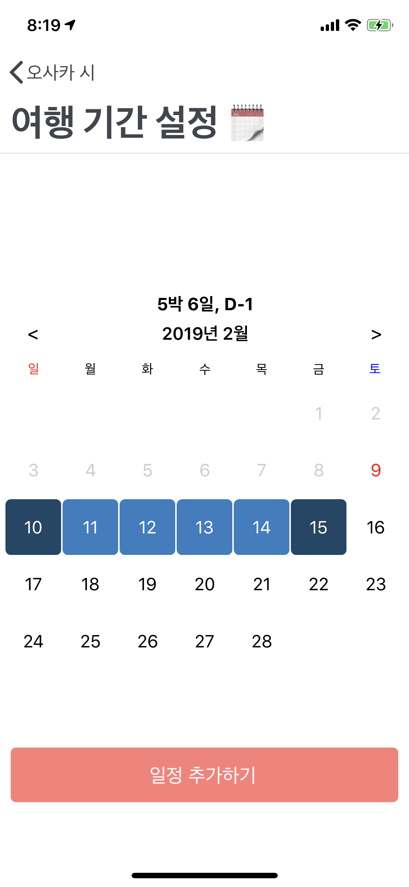

## 메인
D- day 남은 순으로 다시 정렬하여 메인에 표시함


## cell 클릭 시 테이블 뷰 보임
하나의 테이블 뷰에 그 안에 또 테이블 뷰가 있는 구조로 

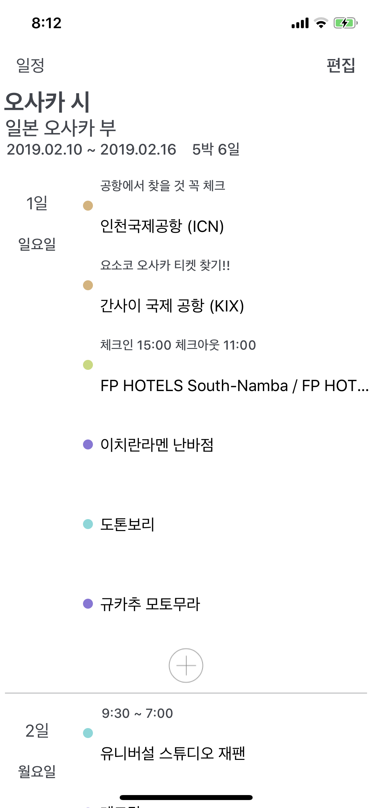

셀 클릭 시 세부 정보를 메모하거나 길찾기 버튼

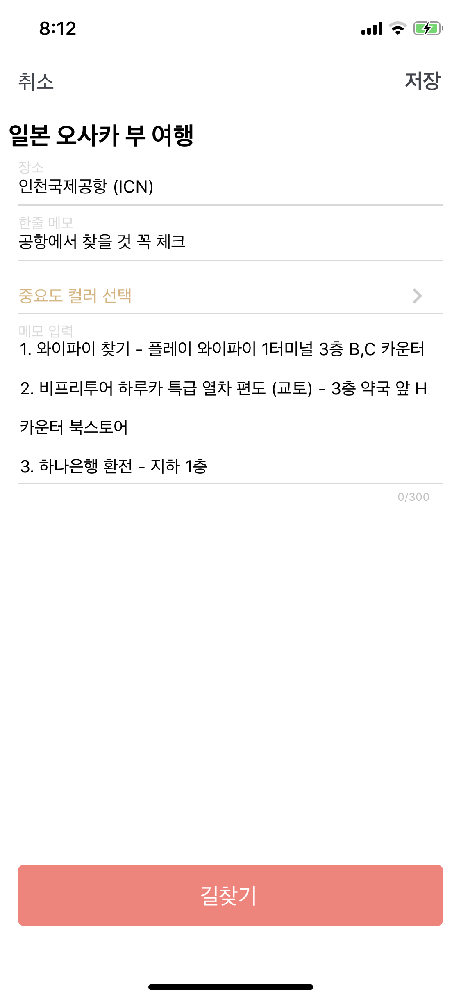

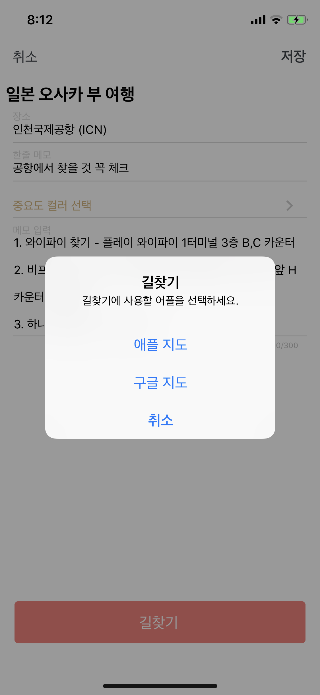

추가 버튼을 누르면 이미지와 함께 숨겨져 있던 버튼들이 나타남
각각 경비, 장소추가, path 보기 버튼임

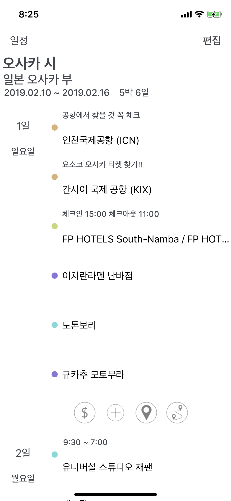

## 여행 경비
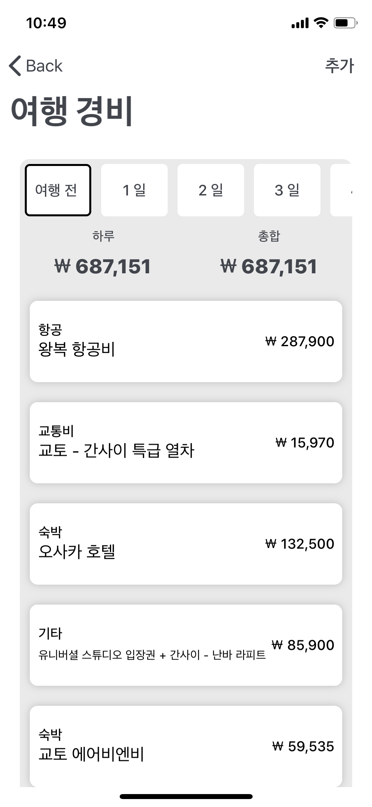

여행 경비 추가

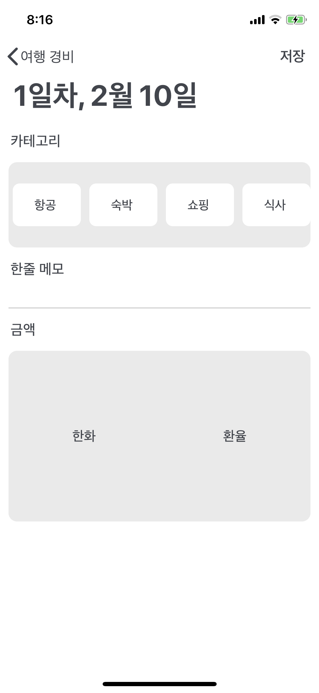

환율 적용 금액 추가 가능

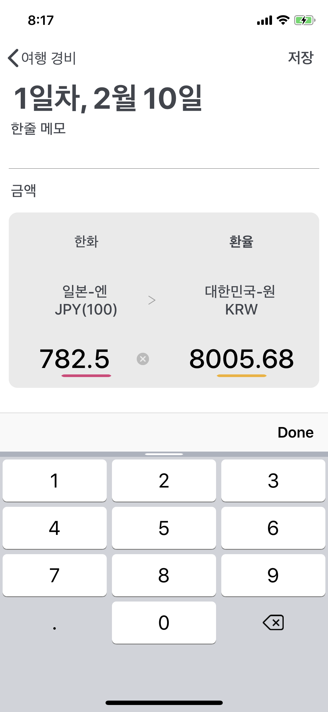


## 장소 추가


## 여행 path 보기
선택한 날짜에 일정 path를 보여준다

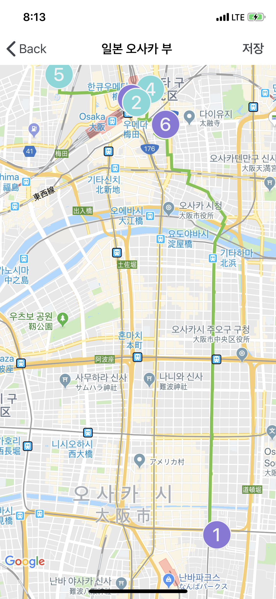

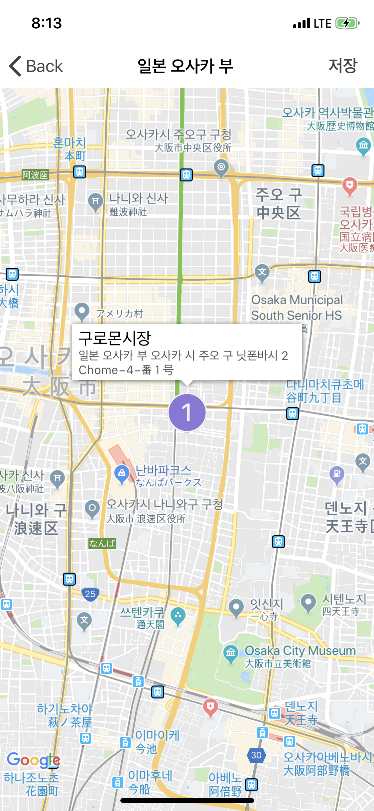
