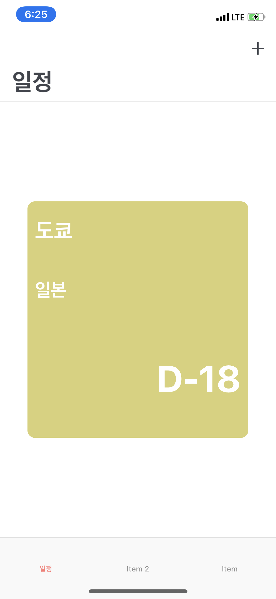
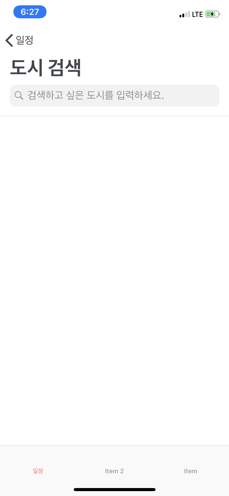
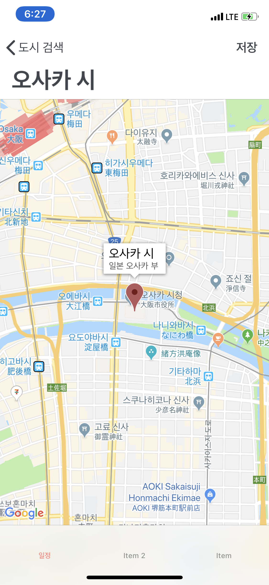
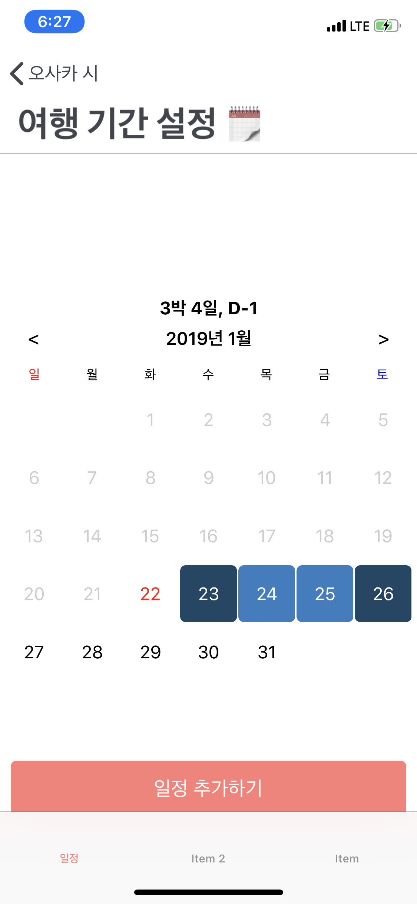
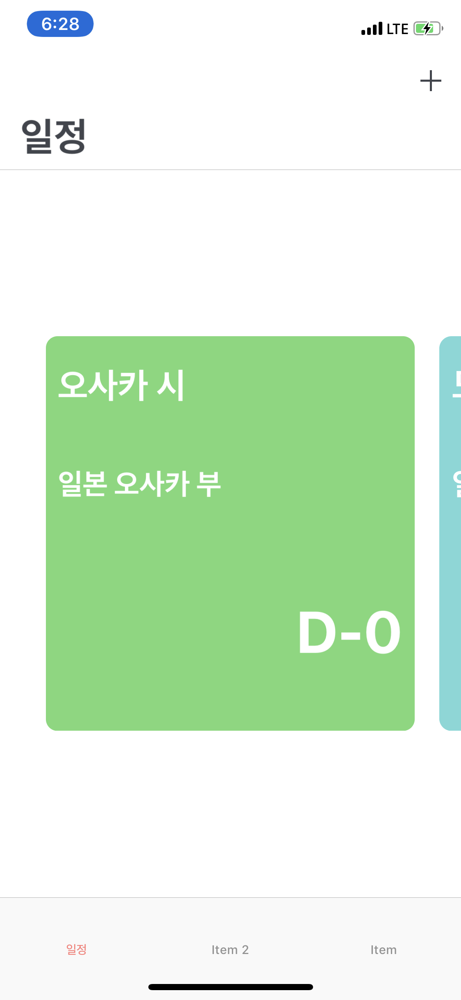
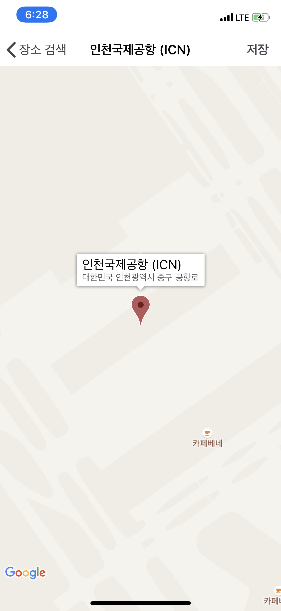
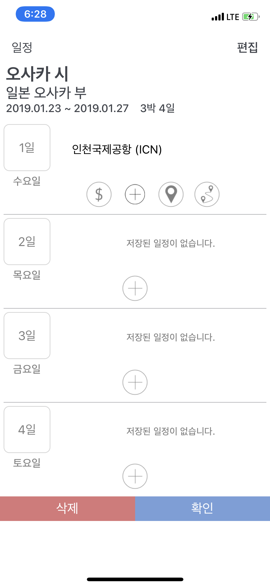
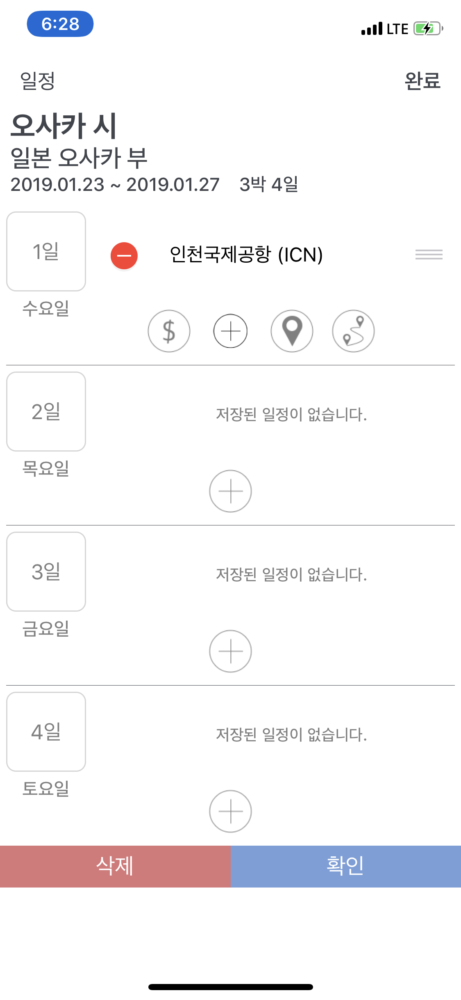
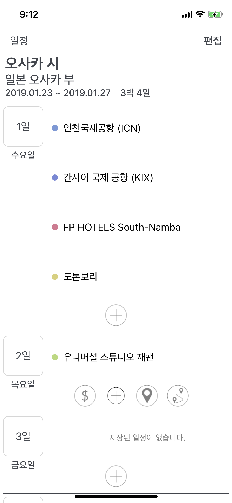
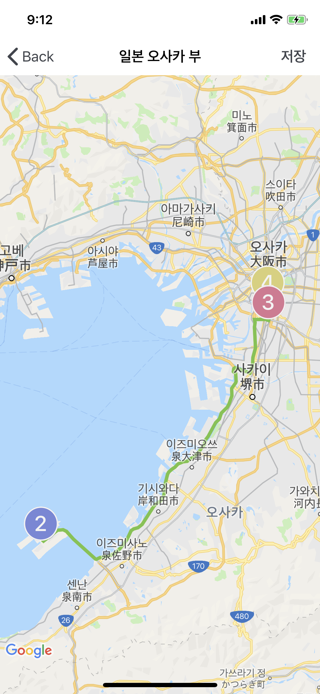

# GoTravel
# 여행일정관리앱, ios 🗺

구글 지도와 Realm을 사용하여 만듬

현재 개발 진행 중

# 소개

## 메인

## 여행지 추가

## 메인
D- day 남은 순으로 다시 정렬하여 메인에 표시함

## cell 클릭 시 테이블 뷰 보임
하나의 테이블 뷰에 그 안에 또 테이블 뷰가 있는 구조로 delegate로 데이터 전달함

추가 버튼을 누르면 이미지와 함께 숨겨져 있던 버튼들이 나타남
각각 가계부, 장소추가, path 보기 버튼임

## 장소 추가

데이터 이동 및 삭제

## cell 클릭 시 디테일 수정

## 여행 장소 중요도 표시

## 여행 path 보기
선택한 날짜에 일정 path를 보여준다

