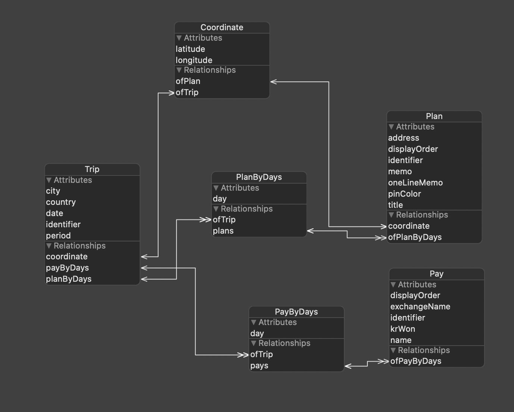

<h1 align="center">트리비 🚀 여행 일정 관리 iOS 앱 🗺</h1>
<p>
</p>

> 여행 일정과 여행 경비를 관리하는 iOS 앱
>
> iOS App to Manage Trip Schedules and Trip cost


## Notice

This is the almost first app I made while studying swift.
I am constantly refactoring this project.
If you are looking for a swift project for learning, I highly recommend viewing [Here Another Repo_Core Data + RxSwift + MemoApp](https://github.com/Haeuncs/MemoApp).


## Download

The app currently only supports Korean.
But you can download.

<a href="https://apps.apple.com/app/%ED%8A%B8%EB%A6%AC%EB%B9%84/id1474451502">

</a>

## How does it run on Xcode?

⚠️⚠️Caution⚠️⚠️

You need your own AppDelegate.swift to run this program.

AppDelegate.swift

```swift

import UIKit
import GoogleMaps
import GooglePlaces
import IQKeyboardManagerSwift
@UIApplicationMain
class AppDelegate: UIResponder, UIApplicationDelegate {

    var window: UIWindow?

    func application(_ application: UIApplication, didFinishLaunchingWithOptions launchOptions: [UIApplication.LaunchOptionsKey: Any]?) -> Bool {
        // Override point for customization after application launch.
      Singleton.shared.googleMapAPIKey = "⚠️Your own google API Key⚠️"
      if let api = Singleton.shared.googleMapAPIKey {
        GMSServices.provideAPIKey(api)
        GMSPlacesClient.provideAPIKey(api)
      }
        IQKeyboardManager.shared.enable = true
      self.window = UIWindow(frame: UIScreen.main.bounds)

      self.window?.rootViewController = TabbarViewController()
      self.window?.makeKeyAndVisible()

      return true

    }
}


```

You need a pod install.
Then run 'GOtravel.xcworkspace'.

Done! 🥳

## DataBase



## Screenshot


## Any Question

- Email: haeun.developer@gmail.com

## Show your support

Give a ⭐️ if this project helped you!
